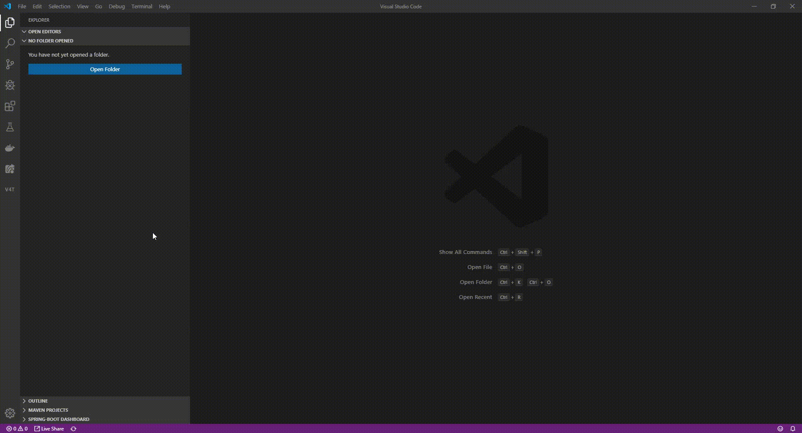
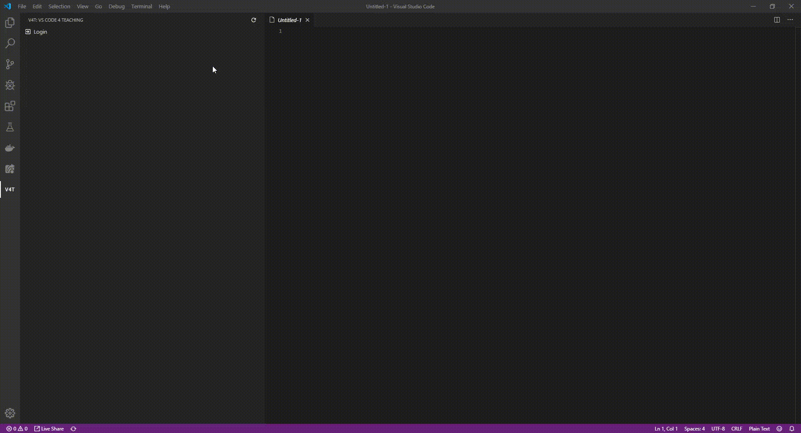
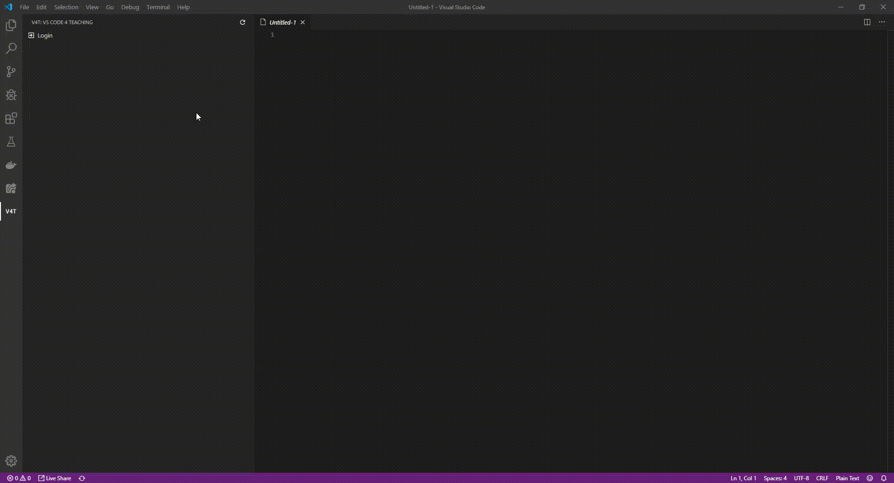
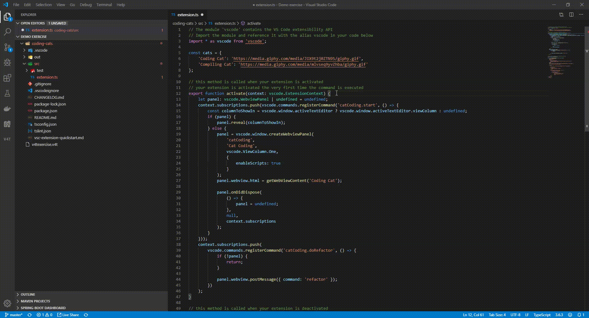

# 2019-VSCode4Teaching

  
VSCode extension for teaching.  
Bring the programming exercises of a course directly to the student’s editor, so that the teacher of that course can check the progress of the students and help them.  
Visit this [Medium blog](https://medium.com/@ivchicano) for updates on the development of this project.  

## Table of Contents

- [Introduction](README.md#introduction)
- [General Roadmap](README.md#general-roadmap)
- [Running, installing and development](README.md#running-installing-and-development)

## Introduction

Current version includes the following functionality:

- Teachers can create courses and exercises for the students.
- Students can download these exercises and upload their updated files.
- Teachers can download the students’ exercises to see their progress.  

The release comes with 2 artifacts: a server and the extension.
In the centralized server all the information is saved: courses, exercises, files… . The server is implemented as a REST API.

The extension is a frontend to interact with the server API.

The model of the application can be described as follows:
There are 2 user roles: Teacher and Student.

- Teachers are capable of creating, editing, deleting, adding and removing users from courses. These courses have exercises, which have an associated template (files that serve as the base of the exercise) and each student’s files. Teachers can also download the students’ files to review them.
- Students can see these courses and exercises, download the templates and automatically upload their files to the server so that the teachers can see them.  

Animations showing the features:
In the first animation we see the teacher creating a course and then creating an exercise (and selecting the files that will be set as the template of the exercise)

In the next animation, we see the student downloading this new exercise:

On the next animation the student edits one of the files and saves it, triggering the automatic file upload so that the teacher can see it (notice the lower part of the screen how a message pops up indicating this upload).

On the next animation, we can see how the teacher selects the exercise previously created and downloads the edited files of the student that previously modified them.

## General Roadmap

- [x] Students can download course exercises and upload his files to the server.
- [X] Teachers can see a student's exercise.
- [ ] Teachers can place requisites on each exercise for the student to accomplish.
- [ ] Teachers can comment on a student's exercise.  
Note: This roadmap is subject to changes as requirements change.  
Check [Issues](https://github.com/codeurjc-students/2019-VSCode4Teaching/issues) and [Project](https://github.com/codeurjc-students/2019-VSCode4Teaching/projects) for more specific information about development of these milestones.

## Running, installing and development

For information about the server click [HERE](/vscode4teaching-server/README.md).  
For information about the extension click [HERE](/vscode4teaching-extension/README.md).
